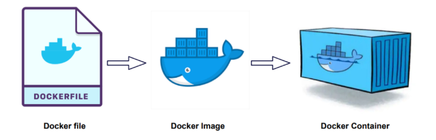

[kubernetes]: https://github.com/JaceKim-TheAL/D2508_Kubernetes
[][kubernetes]

# 도커/쿠버네티스를 활용한 컨테니어 개발

### INDEX

<table>
  <tr>
    <td><a href="sect_01.md">1.DK기초 </a></td>
    <td><b href="sect_02.md">2.DK배포 </b></td>
    <td><a href="sect_03.md">3.CT입문 </a></td>
    <td><a href="sect_04.md">4.KB입문 </a></td>
    <td><a href="sect_05.md">5.SW이용 </a></td>
    <td><a href="sect_06.md">6.KB구축 </a></td>
    <td><a href="sect_07.md">7.KB실전 </a></td>
    <td><a href="sect_08.md">8.CT운영 </a></td>
    <td><a href="sect_09.md">9.DK이미지   </a></td>
    <td><a href="sect_10.md">10.DK활용법  </a></td>
    <td><a href="sect_ABC.md">부록        </a></td>
  </tr>
</table>

---
# S02. 도커 컨테이너 배포
- [01. 컨테이너로 애플리케이션 실행하기]
- [02. 도커 이미지 다루기]
- [03. 도커 컨테이너 다루기]
- [04. 운영과 관리를 위한 명령]
- [05. 도커 컴포즈로 여러 컨테이너 실행하기]
- [06. 컴포즈로 여러 컨테이너 실행하기]

---
### 컨테이너로 애플리케이션 실행하기

| 개념 | 역할 |
|------|-----|
| 도커 이미지 | 도커 컨테이너를 구성하는 파일 시스템과 실행할 애플리케이션 설정을 하나로 합친 것으로 컨테이너를 생성하는 템플릿 역할을 한다 |
| 도커 컨테이너 | 도커 이미지를 기반으로 생성되며, 파일 시스템과 애플리케이션이 구체화돼 실행되는 상태 |



 - 도커 이미지 내려받기 : docker image pull 
 ``` shell
 docker image pull gihyodocker/echo:latest
 ```

- 도커 이미지 실행하기 : docker container run
``` shell
docker container run -t -p 9000:8080 gihyodocker/echo:latest
```

- 간단한 애플리케이션과 도커 이미지 만들기
  - 예제로 Go 언어로 만든 간단한 웹 서버를 도커 컨테이너에서 실행
  - main.go 라는 파일에 다음 코드를 작성
  ``` go
  package main

  improt (
    "fmt"
    "lgo"
    "net/http"
  )

  func main() {
    http.Handlefunc("/", func(w http.ResponseWriter, r * http.Request) {
      log.Println("received request")
      fmt.Fprintf(w, "Hello Docker!!!")
    })

    log.Println("start server")
    server: = & http.Server {
      Addr: ":8080"
    }
    if err: = server.ListenAndServer(); err != nil {
      log.Println(err)
    } 
  }

  ```

- 도커 이미지 빌드하기 
  - -t 옵션으로 이미지명을 지정, 태그명도 지정할 수 잇으며, 생략시에는 latest 태그가 붙는다
  - -t 옵션과 이미지명은 반드시 지정해야 한다고 생각하는 편이 좋다. 
  ``` shell
  docker image build -t 이미지명[:태그명] Dockerfile의 경로
  ```

- 생성된 이미지 확인 : docker image ls
``` shell
docker image ls
```

- 도커 컨테이너 실행 : docker container run
  - -d 옵션 : 백그라운드로 컨테이너 실행
``` shell
docker container run -d examle/echo:latest
```

- 도커 컨테이너 목록보기 : docker container ls
``` shell
docker container ls
```

<br/>

[[TOP]](#index)

---
### 도커 이미지 다루기


<br/>

[[TOP]](#index)

---
### 도커 컨테이너 다루기

<br/>

[[TOP]](#index)

---
### 운영과 관리를 위한 명령

<br/>

[[TOP]](#index)

---
### 도커 컴포즈로 여러 컨테이너 실행하기

<br/>

[[TOP]](#index)

---
### 컴포즈로 여러 컨테이너 실행하기

<br/>

[[TOP]](#index)

---

